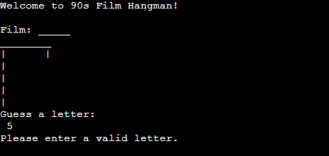

# 90's Movie Hangman Game

The "90s Film Hangman" game is a classic hangman-style word guessing game with a nostalgic twist. 
Players are presented with a random film title from the 1990s, and they must guess the title by suggesting letters. 
The game features iconic films from the decade, providing players with an enjoyable challenge and a trip down memory lane.

[Here is the live version of the game!](https://akestell-p3hangmangame-0f12c6289c8c.herokuapp.com/)

## How To Play
### Starting the Game
- Players initiate the game. 
- The system randomly selects a film title from the 1990s.
- The hangman graphic and underscores representing the film are displayed.

### Guessing Letters
- Players input a letter guess.
- Incorrect guesses result in the progression of a hangman graphic.
- Correct guesses reveal the positions of the guessed letters in the film title.

### Winning and Losing
- The game continues until the player correctly guesses the entire film title or runs out of attempts.
- If the player wins, a congratulatory message is displayed along with the film title.
- If the player loses, a game over message is shown along with the correct film title.

## Features
### Random Film Selection
- A variety of iconic films from the 1990s are included for a diverse gaming experience.

### Hangman Graphic
- Visual representation of the hangman's progression for each incorrect guess.

### User Input Validation
- Ensures that players enter valid single alphabetical characters.

### Dynmaic Display
- Real-time display updates as players make correct guesses or exhaust attempts.

### Future Features#
- Add a 'y/n' option to start a new game when the user has finished the game they are on. 

## Testing
- All code has been tested and validated through the [Code Institute Python Linter](https://pep8ci.herokuapp.com/#) with no errors coming back.

- As noted above, tests are done to make sure that only letters of the alphabet are allowed and only 1 letter at a time. 

- Tested the game on both local terminal and on the Heroku terminal. 

## Bugs
### Solved Bugs
- Had an issue with the incorrect film was displaying after the player ran out of guesses. The issue was that I was calling the 'reset' function too early in the code and it wasn't giving the code a chance to finish the game with the correct information. 
- Ran into a problem with the last piece of the hangman figure was not showing the user ran out of guesses. Issue was resloved again by adjusting where the reset function was called. 

## Deplyment
The project was deployed using Code Institute's mock terminal from Heroku.

## Credits 
- I used code from the following example to build the hangman figure - [HANGMAN CODE](https://gist.github.com/lupinetti/8f89e5f33750aa7c91c3)
- For the initial set up and some ideas for the code, I was able to follow some steps from this video - [VIDEO](https://www.youtube.com/watch?v=m4nEnsavl6w)
